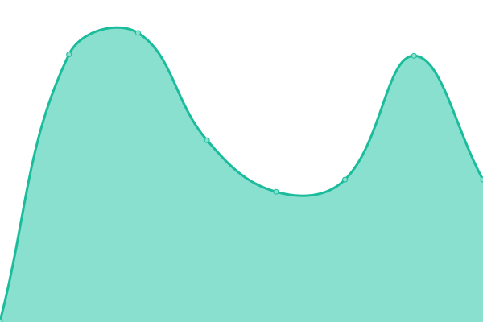
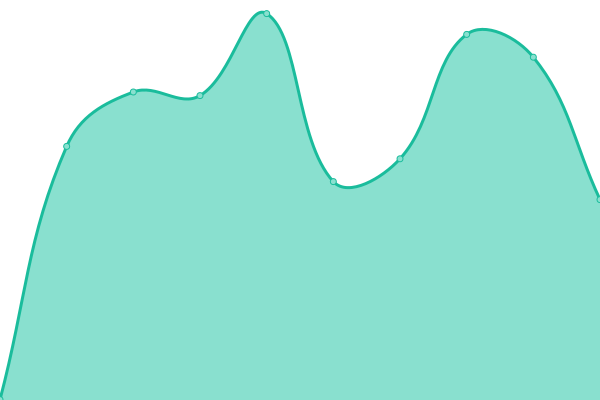
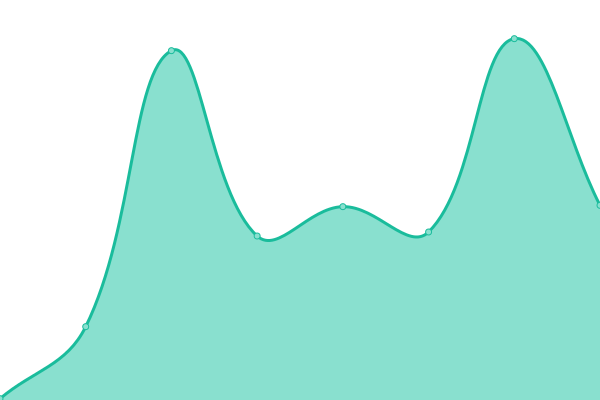
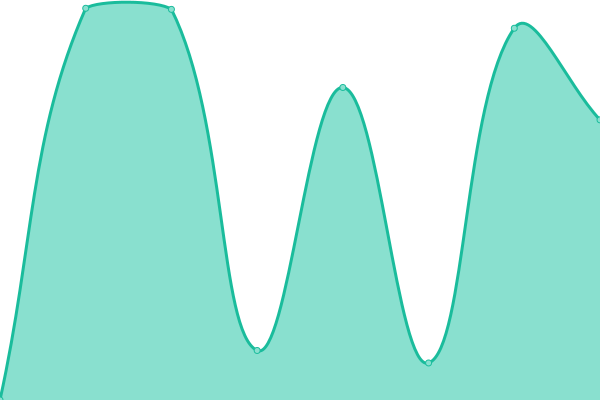
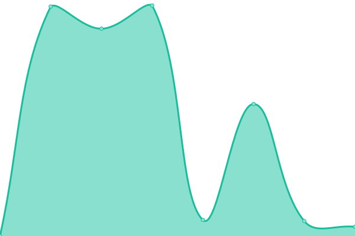

# [📈 Live Status](https://osgpro.github.io/westside-watcher): <!--live status--> **🟧 Partial outage**

This repository contains the open-source uptime monitor and status page for [OSG-PRO](https://osgpro.github.io/westside-watcher), powered by [Upptime](https://github.com/upptime/upptime).

With [Upptime](https://upptime.js.org), you can get your own unlimited and free uptime monitor and status page, powered entirely by a GitHub repository. We use [Issues](https://github.com/osgpro/westside-watcher/issues) as incident reports, [Actions](https://github.com/osgpro/westside-watcher/actions) as uptime monitors, and [Pages](https://osgpro.github.io/westside-watcher) for the status page.

<!--start: status pages-->
<!-- This summary is generated by Upptime (https://github.com/upptime/upptime) -->
<!-- Do not edit this manually, your changes will be overwritten -->
<!-- prettier-ignore -->
| URL | Status | History | Response Time | Uptime |
| --- | ------ | ------- | ------------- | ------ |
|  [Website](https://www.westsidemarket.com) | 🟩 Up | [website.yml](https://github.com/osgpro/westside-watcher/commits/HEAD/history/website.yml) | 

 356ms
     
 | 

<a href="https://status.westsidemarket.com/history/website">100.00%</a>
    

|  [ERP](https://app.westsidemarket.com) | 🟩 Up | [erp.yml](https://github.com/osgpro/westside-watcher/commits/HEAD/history/erp.yml) | 

 660ms
     
 | 

<a href="https://status.westsidemarket.com/history/erp">100.00%</a>
    

|  [API](https://api.westsidemarket.com/v2/states) | 🟩 Up | [api.yml](https://github.com/osgpro/westside-watcher/commits/HEAD/history/api.yml) | 

 683ms
     
 | 

<a href="https://status.westsidemarket.com/history/api">100.00%</a>
    

|  [Portal](https://members.westsidemarket.com) | 🟩 Up | [portal.yml](https://github.com/osgpro/westside-watcher/commits/HEAD/history/portal.yml) | 

 177ms
     
 | 

<a href="https://status.westsidemarket.com/history/portal">100.00%</a>
    

|  [Development Environment](https://development.westsidemarket.com) | 🟩 Up | [development-environment.yml](https://github.com/osgpro/westside-watcher/commits/HEAD/history/development-environment.yml) | 

 8183ms
     
 | 

<a href="https://status.westsidemarket.com/history/development-environment">100.00%</a>
    

|  [Staging Environment](https://staging.westsidemarket.com) | 🟥 Down | [staging-environment.yml](https://github.com/osgpro/westside-watcher/commits/HEAD/history/staging-environment.yml) | 

 0ms
     
 | 

<a href="https://status.westsidemarket.com/history/staging-environment">0.00%</a>
    

<!--end: status pages-->

[**Visit our status website →**](https://osgpro.github.io/westside-watcher)

## 📄 License

- Powered by: [Upptime](https://github.com/upptime/upptime)
- Code: [MIT](./LICENSE) © [Anand Chowdhary](https://anandchowdhary.com), supported by [Pabio](https://pabio.com)
- Data in the `./history` directory: [Open Database License](https://opendatacommons.org/licenses/odbl/1-0/)
